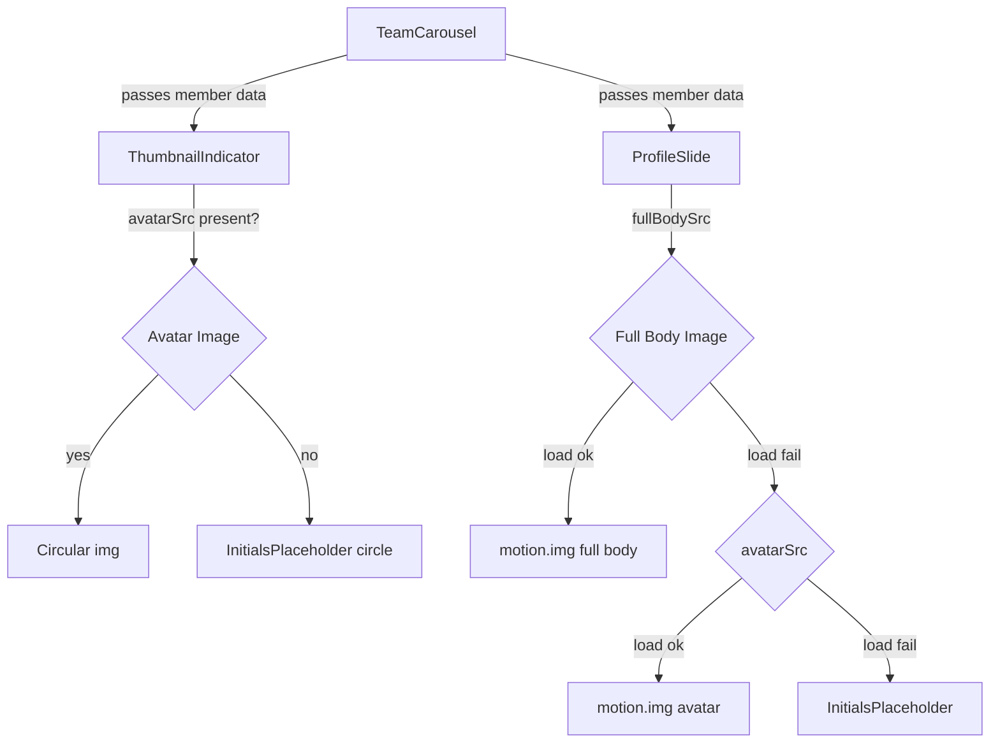

# Design Document: Carousel Avatar Display

## Overview

This feature enhances the TeamCarousel with two visual upgrades:

1. **Circular avatar thumbnails** — replace the current square thumbnail indicators with circular avatar head images (or initials placeholders) that use each member's `roleColor` as the active border.
2. **Full-body character images** — add a full-body illustration to each `ProfileSlide`, displayed to the right of the text on desktop and below on mobile, with a slide-in animation and a graceful fallback chain.

The changes are additive: new data fields, updated component props, and CSS adjustments. No existing carousel navigation logic changes.

---

## Architecture

The feature touches four layers:

```
types.ts          ← add fullBodySrc to TeamMember
constants.ts      ← populate fullBodySrc for all TEAM_SLIDES entries
ThumbnailIndicator← circular avatar/initials rendering + roleColor border
ProfileSlide      ← full-body image + fallback chain + animation
CSS files         ← border-radius, sizing, animation, responsive rules
```



---

## Components and Interfaces

### ThumbnailIndicator

**New props:**

| Prop | Type | Description |
|---|---|---|
| `avatarSrc` | `string` | Path to avatar head image. Empty string triggers initials fallback. |
| `initials` | `string` | Pre-computed initials (e.g. `"PL"`). Used when `avatarSrc` is empty. |
| `roleColor` | `string` | Hex color used for the active border and initials background. |

The existing `imageSrc` prop is removed for profile slides; the cinematic slide thumbnail continues to use the group photo directly (passed as `avatarSrc`).

**Rendering logic:**

```
if avatarSrc is non-empty:
  render 
else:
  render <div className="thumbnail-indicator__initials-placeholder" style={{ backgroundColor: roleColor }}>
           <span>{initials}</span>
         </div>
```

Active state border uses `style={{ borderColor: roleColor }}` on the button element when `isActive` is true, overriding the static pink default.

### ProfileSlide

**New/changed props:**

| Prop | Type | Description |
|---|---|---|
| `fullBodySrc` | `string` | Path to full-body image. Required. Empty string triggers fallback. |
| `avatarSrc` | `string` | Existing prop. Used as fallback when full-body fails. |

**Fallback chain:**

```
fullBodySrc → (onError) → avatarSrc → (onError) → InitialsPlaceholder
```

Implemented with two `useState` flags: `fullBodyError` and `avatarError`. The rendered image element switches based on these flags.

**Animation:**

The full-body image (and its fallbacks) are wrapped in a `motion.div` / `motion.img` using Framer Motion. A new `FULLBODY_SLIDE_VARIANTS` constant is added to `constants.ts`:

```ts
export const FULLBODY_SLIDE_VARIANTS = {
  hidden: { x: 60, opacity: 0 },
  visible: {
    x: 0,
    opacity: 1,
    transition: { duration: 0.6, ease: 'easeOut' }
  }
} as const;
```

`prefers-reduced-motion` is handled by passing `transition={{ duration: 0 }}` when the media query matches, or by using Framer Motion's built-in `useReducedMotion()` hook to skip the animation.

### TeamCarousel

`getThumbnailSrc` is replaced by passing `avatarSrc`, `initials`, and `roleColor` directly to `ThumbnailIndicator`. The cinematic slide thumbnail passes the group photo as `avatarSrc` with empty `initials` and a neutral `roleColor`.

---

## Data Models

### Updated `TeamMember` type (`types.ts`)

```ts
export interface TeamMember {
  id: string;
  name: string;
  role: string;
  description: string;
  avatarSrc: string;      // existing — head/face crop; empty string if unavailable
  fullBodySrc: string;    // NEW — full-body illustration path; empty string if unavailable
  roleColor: string;
}
```

### Updated `TEAM_SLIDES` constant (`constants.ts`)

Each profile entry gains `fullBodySrc`. Members with avatar images also get corrected `avatarSrc` paths (the current data has placeholder paths for members without avatars — these become empty strings).

| Member | avatarSrc | fullBodySrc |
|---|---|---|
| ploof | `/images/team/ploof-avatar.png` | `/images/team/ploof-fullbody.png` |
| bim | `/images/team/bim-avatar.png` | `/images/team/bim-fullbody.png` |
| kio | `/images/team/kio-avatar.png` | `/images/team/kio-fullbody.png` |
| kyoto | `/images/team/kyoto-avatar.png` | `/images/team/kyoto-fullbody.png` |
| mochi | `/images/team/mochi-avatar.png` | `/images/team/mochi-fullbody.png` |
| naze | `/images/team/naze-avatar.png` | `/images/team/naze-fullbody.png` |
| ryzz | `/images/team/ryzz-avatar.png` | `/images/team/ryzz-fullbody.png` |
| yuki | `/images/team/yuki-avatar.png` | `/images/team/yuki-fullbody.png` |
| alex | `""` (no avatar) | `/images/team/alex-fullbody.png` |
| jordan | `""` (no avatar) | `/images/team/jordan-fullbody.png` |
| sam | `""` (no avatar) | `/images/team/sam-fullbody.png` |
| taylor | `""` (no avatar) | `/images/team/taylor-fullbody.png` |
| morgan | `""` (no avatar) | `/images/team/morgan-fullbody.png` |
| casey | `""` (no avatar) | `/images/team/casey-fullbody.png` |
| riley | `""` (no avatar) | `/images/team/riley-fullbody.png` |

The cinematic slide entry is unchanged (no `member` field).

---

## CSS Changes

### ThumbnailIndicator.css

- Change `border-radius` from `4px` to `50%` on `.thumbnail-indicator`.
- Remove `.thumbnail-indicator__image` styles; add `.thumbnail-indicator__avatar` with `border-radius: 50%`, `object-fit: cover`, `image-rendering: pixelated`.
- Add `.thumbnail-indicator__initials-placeholder`: circle, flex-centered, font proportional to size.
- Active border color is now applied via inline `style` (roleColor), so the static `border-color: #ec4899` on `--active` is removed (the class still handles `transform: scale(1.15)`).

### ProfileSlide.css

- Rename `.profile-slide__avatar-container` → `.profile-slide__image-container` (or keep name, adjust sizing).
- Desktop: container is `width: 320px; height: 480px` to accommodate full-body proportions (taller than the old 280×280 square).
- Mobile: container becomes `width: 100%; max-width: 240px; height: 360px; margin: 0 auto`.
- `.profile-slide__fullbody` uses `object-fit: contain`, `height: 100%`, `width: 100%`, `filter: drop-shadow(...)`.
- Existing `.profile-slide__avatar` and `.profile-slide__avatar-fallback` styles are retained for the fallback states.

---

## Correctness Properties

*A property is a characteristic or behavior that should hold true across all valid executions of a system — essentially, a formal statement about what the system should do. Properties serve as the bridge between human-readable specifications and machine-verifiable correctness guarantees.*

### Property Reflection

Before listing properties, redundancy is eliminated:

- 1.1 (avatar image rendered) and 5.6 (initials rendered) are complementary, not redundant — they cover opposite branches of the same conditional.
- 1.2 and 5.6 both describe the initials placeholder. They can be combined into one property covering all members without avatarSrc.
- 1.3 (active border uses roleColor) and 5.3 (active scale) are independent visual properties; kept separate.
- 2.4 (fullbody → avatar fallback) and 2.5 (avatar → initials fallback) form a chain; they are kept as one combined fallback-chain property.
- 2.7 (alt text format) and 2.1 (image rendered) are independent; kept separate.
- 3.2 and 3.3 (data integrity) are complementary examples; kept as one data-integrity property.
- 4.4 (reduced motion) is independent; kept.
- 5.7 (avatar replaces initials when src provided) is subsumed by Property 1 (avatar rendered when src present) combined with Property 2 (initials when src absent) — removed as redundant.

After reflection, the consolidated property list:

---

### Property 1: Avatar image rendered when avatarSrc is present

*For any* `ThumbnailIndicator` rendered with a non-empty `avatarSrc`, the component should render an `` element whose `src` attribute equals `avatarSrc`.

**Validates: Requirements 1.1**

---

### Property 2: Initials placeholder rendered when avatarSrc is absent

*For any* `ThumbnailIndicator` rendered with an empty `avatarSrc`, the component should render an initials placeholder element (no ``) containing the correct initials derived from the member's name, with a background color equal to `roleColor`.

**Validates: Requirements 1.2, 5.6**

---

### Property 3: Active thumbnail border uses roleColor

*For any* `ThumbnailIndicator` rendered with `isActive=true` and any `roleColor`, the button element's border color should equal `roleColor`.

**Validates: Requirements 1.3**

---

### Property 4: Thumbnail click navigates to correct slide

*For any* carousel with N slides, clicking the thumbnail at index `i` should result in the carousel displaying slide `i`.

**Validates: Requirements 1.4**

---

### Property 5: Aria-label contains member name and slide position

*For any* `ThumbnailIndicator` rendered with a given `alt` (member name) and `index`, the button's `aria-label` should contain both the member name and the slide number (`index + 1`).

**Validates: Requirements 1.8**

---

### Property 6: Full-body image rendered when fullBodySrc is present

*For any* `ProfileSlide` rendered with a non-empty `fullBodySrc`, the component should render an `` element whose `src` equals `fullBodySrc`.

**Validates: Requirements 2.1**

---

### Property 7: Fallback chain on image load failure

*For any* `ProfileSlide`, if the full-body image fires `onError`, the component should display the avatar image; if the avatar image also fires `onError`, the component should display the initials placeholder with background color equal to `roleColor`.

**Validates: Requirements 2.4, 2.5**

---

### Property 8: Full-body image alt text format

*For any* `ProfileSlide` rendered with member name `N`, the full-body `` element's `alt` attribute should equal `"N's full body character"`.

**Validates: Requirements 2.7**

---

### Property 9: TEAM_SLIDES data integrity

*For every* profile slide entry in `TEAM_SLIDES`, members known to have a fullbody image file should have a non-empty `fullBodySrc`, and members without an avatar image file should have an empty `avatarSrc`.

**Validates: Requirements 3.2, 3.3**

---

### Property 10: Reduced-motion disables animation

*For any* `ProfileSlide` rendered when `prefers-reduced-motion: reduce` is active, the full-body image element should have no transform offset (i.e. the animation is skipped or instant).

**Validates: Requirements 4.4**

---

## Error Handling

| Scenario | Handling |
|---|---|
| `fullBodySrc` image 404 / network error | `onError` sets `fullBodyError=true`; avatar image is rendered instead |
| `avatarSrc` image 404 / network error | `onError` sets `avatarError=true`; `InitialsPlaceholder` is rendered |
| `avatarSrc` empty string on `ThumbnailIndicator` | `InitialsPlaceholder` rendered immediately (no broken img attempt) |
| `fullBodySrc` empty string on `ProfileSlide` | Treated as immediate fallback to `avatarSrc` |
| Both `fullBodySrc` and `avatarSrc` empty | `InitialsPlaceholder` rendered with `roleColor` background |
| `name` is a single word (no space) | `getInitials` returns the first character only; still valid |

---

## Testing Strategy

### Dual Testing Approach

Both unit tests and property-based tests are required. Unit tests cover specific examples and integration points; property tests verify universal correctness across randomized inputs.

### Unit Tests

Focus areas:
- Cinematic slide thumbnail renders group photo (Requirement 1.5 — specific example)
- `TEAM_SLIDES` data integrity: known members have correct `fullBodySrc` / `avatarSrc` values (Requirements 3.2, 3.3)
- Animation variant constants have `duration <= 0.7` and `ease === 'easeOut'` (Requirements 4.2, 4.3)
- Active thumbnail has `transform: scale(1.15)` CSS class applied (Requirement 5.3)
- Full-body `` has CSS class applying `object-fit: contain` (Requirement 2.6)
- `ThumbnailIndicator` button has `border-radius: 50%` CSS class (Requirement 5.1)

### Property-Based Tests

Library: **fast-check** (already available in the project's ecosystem via Vitest).

Each property test runs a minimum of **100 iterations**.

Tag format: `// Feature: carousel-avatar-display, Property {N}: {property_text}`

| Property | Test file | fast-check arbitraries |
|---|---|---|
| P1: Avatar image rendered | `ThumbnailIndicator.property.test.tsx` | `fc.webUrl()` for avatarSrc, `fc.string()` for name/roleColor |
| P2: Initials placeholder | `ThumbnailIndicator.property.test.tsx` | `fc.string({ minLength: 1 })` for name, `fc.hexaString()` for roleColor |
| P3: Active border uses roleColor | `ThumbnailIndicator.property.test.tsx` | `fc.hexaString()` for roleColor |
| P4: Thumbnail click navigates | `TeamCarousel.property.test.tsx` | `fc.integer({ min: 0, max: slideCount - 1 })` for index |
| P5: Aria-label format | `ThumbnailIndicator.property.test.tsx` | `fc.string()` for name, `fc.nat()` for index |
| P6: Full-body image rendered | `ProfileSlide.property.test.tsx` | `fc.webUrl()` for fullBodySrc |
| P7: Fallback chain | `ProfileSlide.property.test.tsx` | `fc.record(...)` for full member data |
| P8: Alt text format | `ProfileSlide.property.test.tsx` | `fc.string({ minLength: 1 })` for name |
| P9: TEAM_SLIDES data integrity | `constants.property.test.ts` | deterministic (no arbitraries needed — iterate the constant) |
| P10: Reduced-motion | `ProfileSlide.property.test.tsx` | mock `useReducedMotion` returning `true` |

### Property Test Configuration

```ts
// Minimum iterations
fc.assert(fc.property(...), { numRuns: 100 });
```

Each test file already exists in the project; new property tests are added to the existing `.property.test.tsx` files.
